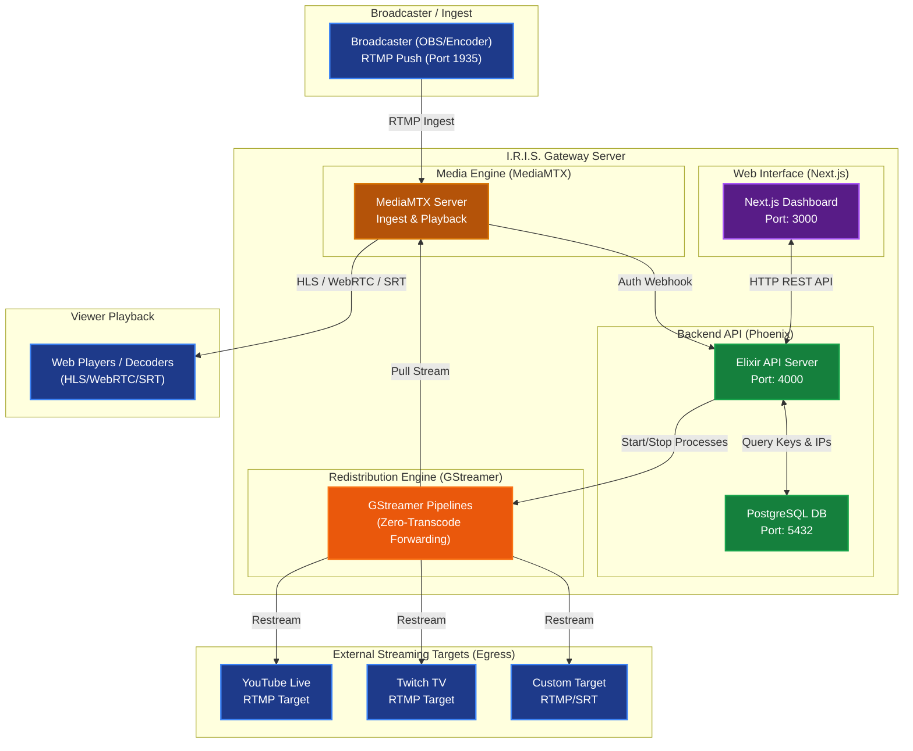

# 👁️ Project I.R.I.S.
### Ingest & Redistribution Integrated Streaming Gateway

Project **I.R.I.S.** is a high-performance, web-based RTMP ingest and zero-transcode redistribution streaming gateway. Designed for broadcasters, it allows pushing a single RTMP feed into the gateway, instantly generating web-playable links (HLS, WebRTC, HTTP-FLV, SRT), and restreaming that feed simultaneously to unlimited destinations (YouTube, Twitch, Facebook, or custom RTMP/SRT servers) with near-zero CPU overhead.

---

## 🛠️ Technology Stack

| Layer | Component | Technology | Purpose |
|---|---|---|---|
| **Frontend** | Web UI | React 18 + Next.js + Tailwind CSS | Interactive operator dashboard & route monitor |
| **Backend** | API Engine | Elixir + Phoenix Framework | Route orchestration, client auth webhooks, DB management |
| **Database** | Storage | PostgreSQL | Persistence for users, stream keys, whitelists, and destinations |
| **Media Engine** | Edge Routing | MediaMTX (Go-based) | Ingest receiver and multi-protocol playback publisher |
| **Forwarding** | Redistribution | GStreamer | High-performance, zero-transcode pipeline orchestration |
| **Container** | Infrastructure | Docker + Docker Compose | One-command local and production orchestration |

---

## 🗺️ System Architecture

The following diagram illustrates how video streams flow into the I.R.I.S. gateway, authenticate, and redistribute to viewers and external targets:



---

## 🚀 Quick Start

### 1. Requirements
Ensure you have **Docker** and **Docker Compose** installed on your system.

### 2. Start the Gateway
Clone the repository and spin up the containers from the project root:
```bash
docker-compose up --build
```

### 3. Ports Mapping
Access the services locally using the following endpoints:
* **Frontend Web Dashboard:** [http://localhost:3000](http://localhost:3000)
* **Backend REST API:** [http://localhost:4000](http://localhost:4000)
* **MediaMTX Admin Dashboard:** [http://localhost:9997](http://localhost:9997)
* **RTMP Ingest Port:** `1935`
* **SRT Playback Port:** `8890` (UDP)
* **HLS Playback Port:** `8888`
* **WebRTC Playback Port:** `8889`

---

## 📜 Coding Guidelines & Roadmap

Refer to the following documents for development guidelines and roadmap details:
* [agents.md](file:///Users/eldyreynanda/Developer/Antigravity/iris-project-gemini/agents.md) — Coding instructions and guidelines for AI agents working on this project.
* [roadmap.md](file:///Users/eldyreynanda/Developer/Antigravity/iris-project-gemini/roadmap.md) — Implementation gaps, security targets, and features backlog.
* [backend/AGENTS.md](file:///Users/eldyreynanda/Developer/Antigravity/iris-project-gemini/backend/AGENTS.md) — Elixir, Phoenix, and Ecto coding standards.
